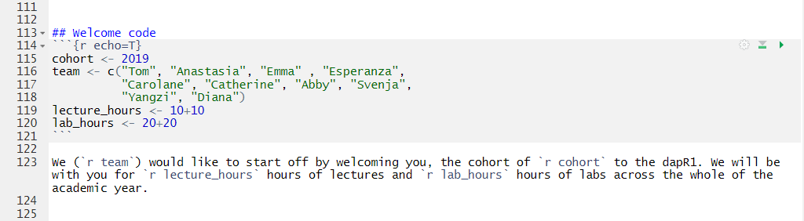
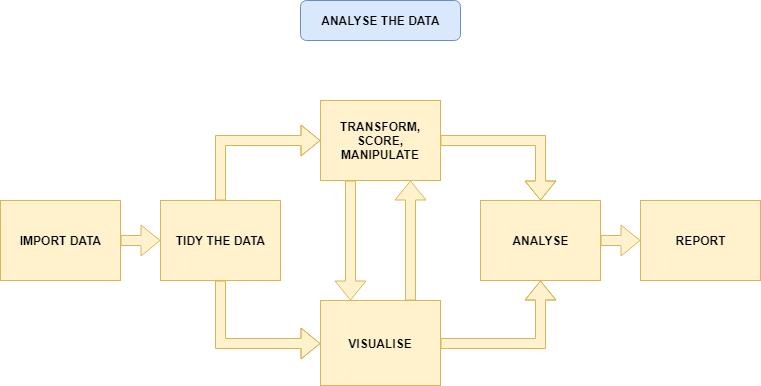

```{r premable, echo=FALSE, warning=FALSE, message=FALSE}
library(tidyverse)
```

# Welcome
```{r welcome, echo=FALSE}
cohort <- 2019
team <- c("Tom", "Anastasia", "Emma" , "Esperanza", 
          "Carolane", "Catherine", "Abby", "Svenja",
          "Yangzi", "Diana")
lecture_hours <- 10+10
lab_hours <- 20+20
```

We (`r team`) would like to start off by welcoming you, the cohort of `r cohort` to the dapR1. We will be with you for `r lecture_hours` hours of lectures and `r lab_hours` hours of labs across the whole of the academic year.

## Today
- dapR and your degree
    - Plus a few course details
- dapR and life
- Expectations
- *We will talk about the overall research process and measurement next lecture*

## Learning objectives
- Understand how dapR1 fits into the psychology degree
- Understand the basic structure of the course
- Understand the way in which learning from this course fits into the data analysis process

## Intro to us....
- Tom: CO, lecturer 
- Anastasia: Senior Teaching coordinator - the boss of labs (*really just the boss*)
- Wonderful lab tutors:
    - Emma 
    - Esperanza 
    - Carolane 
    - Catherine 
    - Abby 
    - Svenja 
    - Yangzi 
    - Diana 
    
## Where does dapR1 fit? {data-background-size="contain" data-background-transition="fade" data-background="timeline1.png"}

## dapR 1 {data-transition="slide-in fade-out" data-background-size="cover" data-background-transition="slide" data-background="tile01.png"}

- New course for 2019-20 (*in response to student feedback*)
- dapR courses (1, 2 & 3) are replacing the RMS courses.
- In dapR1, we will teach you how to...
    - get data into R,
    - tidy it, manipulate it and transform it,
    - visualise it, and
    - a little bit of analysing it.
- Important skills for psychology and life.

## dapR 1: Aims {data-transition="fade" data-background-size="cover" data-background-transition="none" data-background="tile01.png"}

- Build the core data and R skills.
    - And to do so at a slow and steady pace.
- Introduce some key statistical concepts.
- Help you develop an effective approach to studying data analysis.
- Encourage you as a cohort to be collaborative, supportive peers.
- Integrate with Psychology 1A and 1B.

## dapR 1: Structure {data-transition="fade" data-background-size="cover" data-background-transition="none" data-background="tile01.png"}
- 1x 1 hour lecture per week (Theory).
- 1x 2 hour lab per week (Practical).
- Plus some reading;
    - This will appear on LEARN and linked on top of each lab.
    - Quite low volume (but we can provide more if you would like it). 
    - We want you to spend time practising skills.
    
## dapR 1: Assessment {data-transition="fade" data-background-size="cover" data-background-transition="none" data-background="tile01.png"}

- Weekly quizzes (30%)
    - Quizzes 1 and 2 are practices.
    - Quizzes 3 to 20 count.
    - Mark is the average of your best 14/18 scores.
- 3 lab tests (30%; 10% each)
    - 5 questions that require code to answer
    - Completed in lab
- Coursework report (40%)
    - Organise some data, produce some plots, run and interpret some analysis.

## What is R? {data-transition="fade" data-background-size="cover" data-background-transition="none" data-background="tile01.png"}

- A very flexible, very cool, programming language for all things data.
    - It does pretty much any statistical method you can think of. (Cool? I think so)
    - But it does a lot more.
- We will also begin to teach you Rmarkdown - this is a cool way to integrate text and analysis

## What is R? {data-transition="fade" data-background-size="cover" data-background-transition="none" data-background="tile01.png"}
- Some examples:
    - [interactive plots](https://shiny.rstudio.com/gallery/movie-explorer.html)
    - [interactive dashboards](https://gallery.shinyapps.io/086-bus-dashboard/) 
    - Documents with automatically include results from analysis

## Remember this...
```{r echo=FALSE}
cohort <- 2019
team <- c("Tom", "Anastasia", "Emma" , "Esperanza", 
          "Carolane", "Catherine", "Abby", "Svenja",
          "Yangzi", "Diana")
lecture_hours <- 10+10
lab_hours <- 20+20
```

We (`r team`) would like to start off by welcoming you, the cohort of `r cohort` to the dapR1. We will be with you for `r lecture_hours` hours of lectures and `r lab_hours` hours of labs across the whole of the academic year.


## Welcome code



## What is R? {data-transition="fade" data-background-size="cover" data-background-transition="none" data-background="tile01.png"}

- Some examples:
    - [interactive plots](https://shiny.rstudio.com/gallery/movie-explorer.html) 
    - [interactive dashboards](https://gallery.shinyapps.io/086-bus-dashboard/) 
    - Documents with automatically include results from analysis
    - [books](https://bookdown.org/csgillespie/efficientR/) #inc
    - [websites](https://rmarkdown.rstudio.com/) #inc
    - Presentations (like the one you are looking at) #inc

## What is R? {data-transition="fade" data-background-size="cover" data-background-transition="none" data-background="tile01.png"}

- But what is best of all is it is completely free.
- You can go and download the R-code that made everything I just showed you.
- There is a massive R community, and a world of resources and help.

## Where does dapR1 fit? {data-background-size="contain" data-background-transition="none" data-background="timeline1.png"}

## dapR 2 {data-transition="slide" data-background-size="cover" data-background-transition="slide" data-background="tile02.png"}

- dapR 2 will build on the core skills developed in dapR 1.
- Major focus here is on analysing data.
- We will cover a majority of the analytic techniques used in psychological science.
    - BUT importantly we will integrate into a single framework
- This course will have more *individual*  assessment.

## dapR 3 {data-transition="slide" data-background-size="cover" data-background-transition="slide" data-background="tile03.png"}

- Honours level data analysis course.
- Theoretical focus: some advanced models and thinking critically about statistics.
- Practical focus: taking real data, in the form it comes from the tools we use to do our studies.
- Then using the skills we have built up to answer questions, and report the answers in a variety of formats.

## dapR 3 {data-transition="fade-in slide-out" data-background-size="cover" data-background-transition="slide" data-background="tile03.png"}


    
## Mini Dissertation {data-transition="slide" data-background-size="cover" data-background-transition="slide" data-background="tile04.png"}

- Then you do this for real!
- Year 3 mini-dissertation is a group research project with a member of faculty.
- Now you can apply the skills to your own project, with a group to help problem solve.

## The real thing {data-transition="slide" data-background-size="cover" data-background-transition="slide" data-background="tile05.png"}

- Then in year 4, you will have the real deal dissertation.
    - Well, for those of you who stay with psych.
- A real project you can really take ownership of.

## Life {data-transition="slide-in fade-out" data-background-size="cover" data-background-transition="slide" data-background="tile06.png"}

- And once all that is done, it may be time to face down life.
- But don't think you will leave these skills behind.
- My last 3 months....

## Life {data-transition="fade-in slide-out" data-background-size="cover" data-background-transition="slide" data-background="tile06.png"}

- Oh and £££
- Well I can't really promise this, but data science and highly numerate jobs tend to pay pretty well!

## What you can expect from us
1. We will work hard to help you learn.
2. We will be open and communicate with you.
3. We will treat you like adults.

## What I expect of you
1. You work hard.
2. That you talk to me and the teaching team.
3. That you are polite, and respect the teaching team and your classmates.
4. Try and have fun.

## Tasks for this week...
1. All prep work required for the lab.
2. Please read all course documentation.
3. Quiz 1: "Pub Quiz"
    - Live now, closes Sunday at 17:00
    
# Questions?
