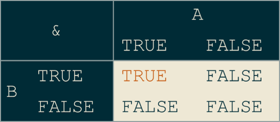
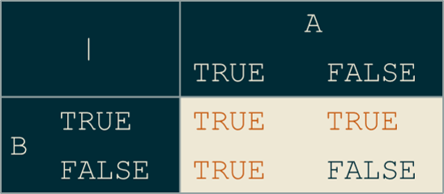
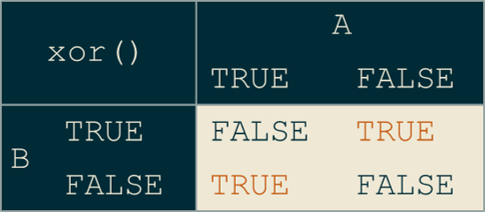
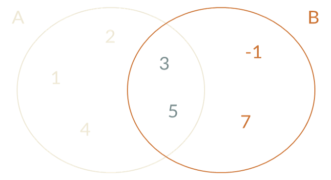
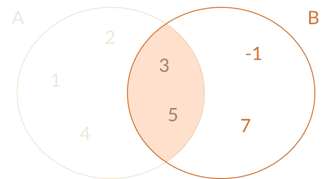
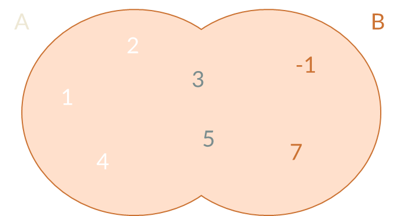
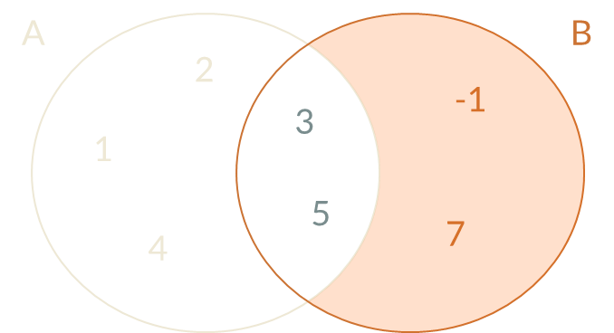
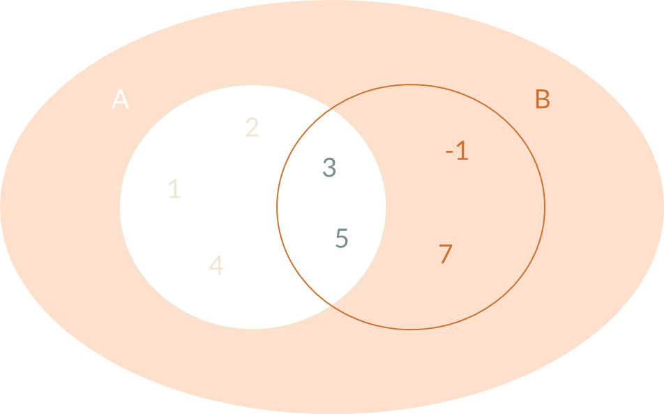
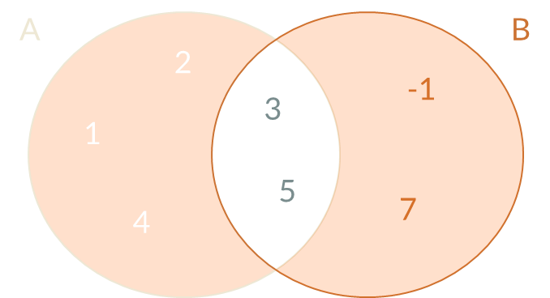

```{r setup, include=FALSE}
knitr::opts_chunk$set(echo = FALSE)
```


# Introductory Stuff {data-background="pics/intro2.jpg" data-transition="fade"}

## Briefly about me {data-background="pics/about_me2.jpg" data-background-transition="fade" data-transition-speed="slow" data-transition-speed="slow"}

- PhD Pychology, University of Edinburgh
- Psychometrician, Royal College of Surgeons of Edinburgh (stats, coding in `R`)
- Teaching post-doc in statistics in `R`, University of Edinburgh
- Senior teaching co-ordinator, University of Edinburgh

## Office hours

- Not compulsory but I'd encourage you to make use of them
- Flexible - send me a meeting request individually or as a group at https://doodle.com/mvalasek
- Questions can be
    - About the course
    - Conceptual
    - Coding issues
    - About slides
    - About lab exercises
    - Generally about stats

## Arrest this man, he talks in maths {data-background="pics/karma2.jpg" data-transition="fade"}

- There will be numbers, there will be maths
- Maths (and logic) is the language of computers, statistics, science, and -- it seems -- the universe
- We will focus on developing a conceptual undestanding and intuition
- We won't discuss anything that is beyond your capability to understand
- It won't be a walk in the park though so do put in the hours

## If you find yourself struggling

- Go back to where you last felt on top of things and take it from there
- **Come** talk to us
- **Ask** questions during the lectures
- Make use of the discussion forum on LEARN
- Take a deep breath, go for a walk, **you'll be fine**!

# Overview of Weeks 2-5

## Lectures

- Conceptual basis for statistical analysis
    - Logic & sets, probability, independence, sampling, variables, descriptive statistics
    - Functions, basic data visualisation, sampling distribution, Central Limit Theorem
    - Hypotheses, probability distributions, significance testing
    
- Basic statistical tests
    - *z*-test, *t*-test, *\(\chi\)^2^* test, correlation, *F*-test
    
    
## Labs

- Fundamentals of `R`
    - Commands, objects, functions, data structures
    - Working with data: indexing, subsetting, transformations
- Exploring and visualising data
    - Descriptive statistics, plots
- Basic statistical tests in `R`

## Before we start

- All clear regarding research questions/design and measurement?

## Today

- Logic, sets, probability
    - Probability theory is the basis for all of statistics
    - Sits on a foundation of logic and set theory
    - Not the focus of this course but we need to talk about these topics a little
- Sampling & independence
- Variables
    - Descriptive statistics


# That's logic, innit! {data-background="pics/logic2.jpg" data-transition="fade"}

## Logic

- Informally, a discipline concerned with truth value of statements, relationships between objects, and inference based on them
- There are several systems of logic but we will only discuss **Boolean** logic, in which a statement can be exclusively either `TRUE` (1) or `FALSE` (0)
- The basis of all maths and computing
- If you want to be able to code, you need to understand at least the basics
- *Note.* The following is a **strictly informal** treatment of logic. Instead of using formal notation, I will use the `R` notation 
 
## Logic -- truth value (1)

- Statement is a meaningful utterance about objects in the world and their relationships.
    - *e.g., "Today is Wednesday."* or *"Two is qual to five."*
 
- Based on the nature of the relationships and the premises, a statement can either be `TRUE` (1) or `FALSE` (0)
- Premises don't have to be *"true"* in the sense of corresponding to our experience of reality. We can assess the truth value of a statement even if it's based on outlandish premises

## Logic -- truth value (2)

1) *All rivers are laughter*
2) *All laughter takes a chance*

    Therefore

3)  *All rivers take a chance*

- The conclusion is a valid inference based on the premises and so is `TRUE`, even though it sounds like New Age "wisdom"

```{r, size="normalsize",}
# R-ish for "equals" or "is" is ==, not = !
weekdays(Sys.Date()) == "Wednesday"

2 == 5

# object orange has the value "apple" (premise)
orange <- "apple"
orange == "apple"
```

## Logic -- Boolean operators (1)
- Logical operators express relationships between objects (equality, `==`, is an example)
- There are lots of them but we will focus on four *Boolean operators*:
  - NOT (`!`)
  - AND (`&` in `R`)
  - OR (`|`)
  - exclusive OR, XOR (the `xor()` function in `R`)

## Logic -- Boolean operators (2)
- They are quite intuitive except for the OR/XOR distinction
- A statemnt linking two objects statements with OR is `TRUE` if **either** of the partial statement is `TRUE` **or both of them** are `TRUE`
- XOR returns `TRUE` **if and only if one of the statements** is `TRUE`

## Logic in `R`
- *Note.* `%in%` is a membership operator in `R` -- `a %in% A` means "element `a` is in the object `A`"; Its result is `TRUE`/`FLASE`
 
```{r}
A <- 1:5 # A contains numbers from 1 to 5
B <- c(-1, 3, 5, 7) # B contains numbers -1, 3, 5, and 7

1 %in% A

1 %in% B
```
 
- If the thing to the left of `%in%` is an object containing several elements, the results will be one logical value per element (*i.e.,* `%in%` is *vectorised*)
 
```{r}
A %in% B
```

## Logic -- NOT (`!`)

- The simplest operator
- Negates the subsequent statement, *i.e.,* turns `TRUE` to `FALSE` and *vice versa*
- if `A == B` is `FALSE`, `!(A == B)` or `A != B` will be `TRUE`

```{r}
a <- TRUE
!a

!(1 %in% A)
```

## Logic -- AND (`&`)



```{r}
1 %in% A & 5 %in% B # 1 is in A AND 5 is in B
```

`!(A & B)` is equivalent to `xor(A, B) | (!A & !B)`

## Logic -- OR (`|`)



```{r}
-30 %in% A | 5 %in% B # first FALSE, second TRUE
```

`!(A | B)` is equivalent to `(!A & !B)`

## Logic -- XOR (`xor()`)



```{r}
xor(5 %in% A, -1 %in% B) # both TRUE
```

`!xor(A, B)` is equivalent to `(A & B) | (!A & !B)`


# Get set . . . {data-background="pics/sets2.jpg" data-transition="fade"}

## Sets (1)

- Set theory sits on a foundation of logis and forms the basis for all maths
- Set is a well-defined group of objects/elements: we can tell which elements belong to which set
- You can think of our two groups `A` and `B` from before as sets



## Sets (2)

- *Subset* of set `A` is a set that **only contains elements that are also in** `A` 
- Sets `C` and `D` are equal if and only if `C` is a subset of `D` AND `D` is a subset of `C`
- Subset of a set `A` that is *not equal* to `A` is called **proper subset**

## Set operations

- You can think of elements of a set as statements about the elements' membership of a given set
    - 1 is in `A`
    - 3 is in `A`
    - 3 is in `B`...
- Just like you can perform logical operations on statements, you can perform set operations on sets
- Logical and set operations are analogous of each other

## Set intersection

- Intersection of sets `A` and `B` consists of elements that are present in **both** of these sets
- Analogous to `A & B`



- Intersection of two sets that do not share elements is an *empty set* -- &empty;

## Set union

- Union of sets `A` and `B` consists of all elements that are present in **either** of these sets
- Analogous to `A | B`



\ 

## Set difference

- Difference between sets `B` and `A` consists of all elements that are in `B` **but not in** `A`
- Analogous to `B & !A`



- *Question:* What is the difference of `C` and `D` such that `C` is equal to `D`?


## Set complement

- Complement of set `A` consists of all elements that are **in the universal set but not in** `A`
- Analogous to `!A`

{height=400px}

## Union of differences

- Not an operation in its own right but a combination of union and difference
- *Question:* Which logical operation is analogous to the union of `A` -- `B` and `B` -- `A`?



> - `xor(A, B)` or `(A & !B) | (B & !A)`


# Probability {data-background="pics/probability2.jpeg" data-transition="fade"}

## \ {data-background="../gif/rain.gif"}

```{r, echo=FALSE}
htmltools::includeHTML("../css/timer.html")
```

# And that's all for now!

