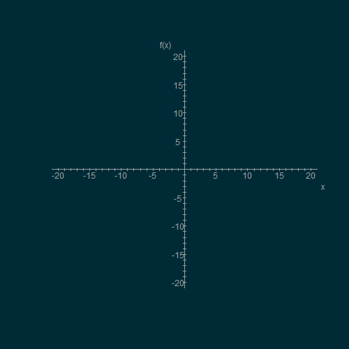
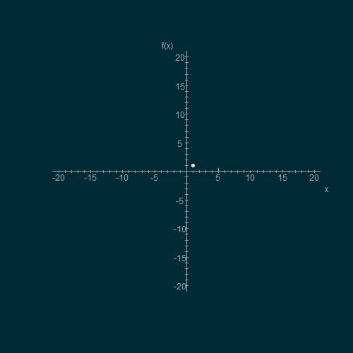
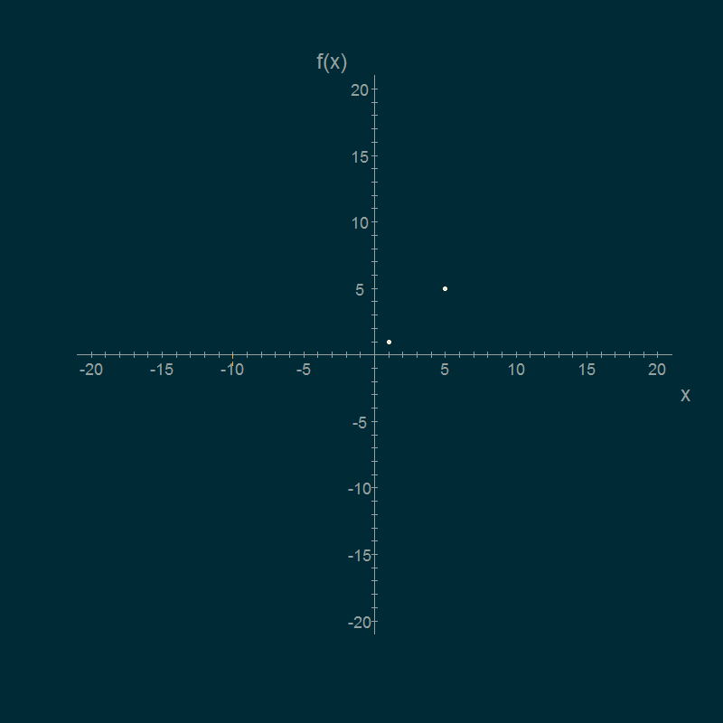
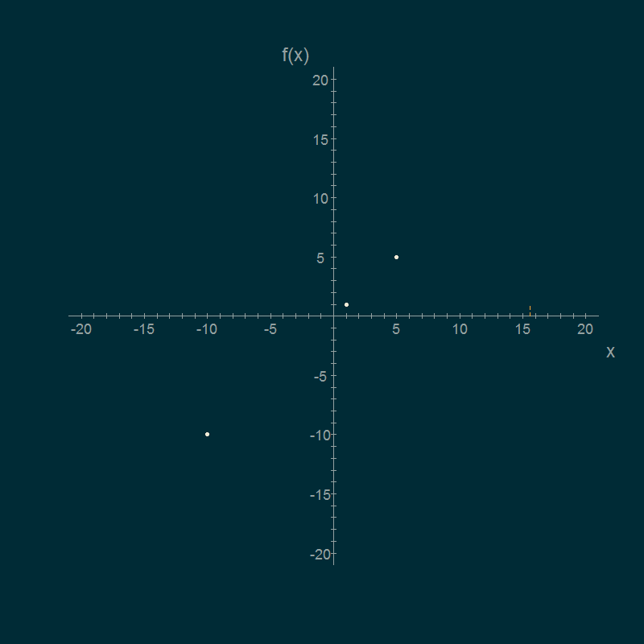
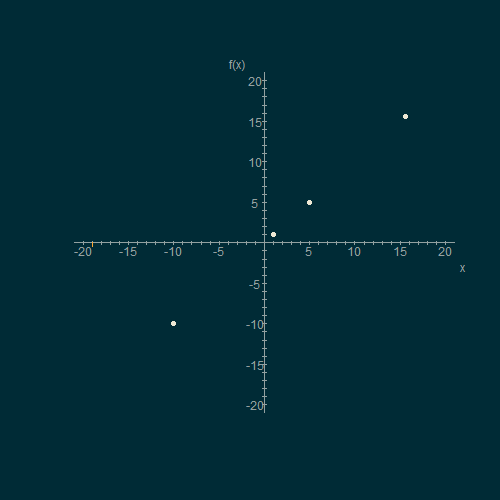
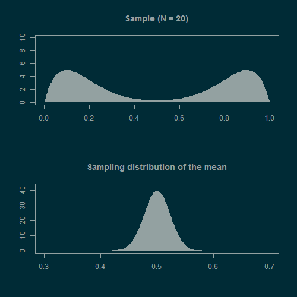

```{r, setup, include=F}
knitr::opts_chunk$set(comment=NULL, collapse=T, strip.white=F)
def.chunk.hook  <- knitr::knit_hooks$get("chunk")
knitr::knit_hooks$set(chunk = function(x, options) {
  x <- def.chunk.hook(x, options)
  ifelse(options$size != "normalsize", paste0("\\", options$size,"\n\n", x, "\n\n \\normalsize"), x)
})
```

## Before we start

<script src="../js/gif.js"></script>

- Any questions about last week's matters?

## Today

- Functions
- Basic data visualisation
- Distributions
- Sampling distribution
- Central Limit Theorem

<!-- speaker notes -->
<aside class="notes" data-markdown>
- Slides available online
- use chrome to print/save as PDF
</aside>

# Fun in `function()` {data-background="pics/fun2.jpg"}

## Functions

- Informally, function a process that takes some input and turns it into a unique output
- Individual inpults are called **parameters**
<br> \ 
<br> \ 
<br> \ 
<br> \ 
<br> \ 
<br> \ 

## Play time! {data-background="pics/play2.jpg"}

> - You just invented the *identity* function!
> - $f(x) = x$

## Functions

- Informally, function a process that takes some input and turns it into a unique output
- Individual inpults are called **parameters**
- The pocess itself is the **definition** of a function

> - $f(x) = x^2$
> - $f(2) = 4$
> - $f(5) = 25$
> - $f(0) = 0$
> - $f(1) = 1$

## Functions in the real world

- It's not *"just maths"* (nothing ever is)
- Everyday operations can be seen as functions of some arguments
- Who's taller? Me or Martin?

> - Measure my height
> - Measure Martin's height
> - Compare the two
> - If not equal, return name of taller person
> - Else return *"both are the same height"*
> - $taller(Martin, Milan) = Martin$

<!-- speaker notes -->
<aside class="notes" data-markdown>
This is probably not how we do this but it's a good illustration
</aside>

## Functions in `R`

- Functions are ubiquitous in `R` (and any other programming language)
- Basically the same as mathematical functions but can be much more complex
- Also take arguments, have definitions, and return output

```{r}
# define f as function of argument x
f <- function(x) {x*x}
# works
f(2)
f(100)
```

## Functions in `R`

- Every operation is a function -- `<-`, `+`, `sum()`, `sd()`
- If the function was built in `R` you can see its definition

```{r}
# see the code inside the sd() function
sd
```

<!-- speaker notes -->
<aside class="notes" data-markdown>
- You don't need to understand the code
- Just understand that the functions aren't magic
- They just apply some procedure to some arguments to produce some output
</aside>

## Functions brake

- Functions are not all-powerful
- They need the right kind an number of arguments
    - kitten^2^ means nothing
    - $taller(Martin)$ doesn't give enough arguments
- Output of some arguments might not be defined
    - Division by zero

```{r, error=T}
# wrong kind of argument
f("Milan")
# incorrect number of arguments
sd()
```

## All sorts

- Functions range from vey simple to *huge*
- They can look intimidating but they all do the same thing:
    - Take **arguments**
    - Apply some defined **operation** to them
    - Return **output**
    
<br><m>$$g(x, \mu, \sigma) = \frac{e^{-\frac{1}{2}(\frac{x-\mu}{\sigma})^2}}{\sigma\sqrt{2\pi}}$$</m>

<!-- speaker notes -->
<aside class="notes" data-markdown>
- All clear?
</aside>

## Visualising functions

- Function parameters and output can be visualised as perpendicular axes in space
- Because our world has 4 dimensions (3 spatial + time), visualising functions with more than 3 varying parameters is tricky (even 3 is a bit of a stretch)

## Visualising functions {data-transition="fade-in none-out"}

- Let's start simple: <m>$f(x) = x$</m>
\

<section></section>

## Visualising functions {data-transition="none"}

- Let's start simple: <m>$f(x) = x$</m>
\

<section data-gif="repeat"></section>


## Visualising functions {data-transition="none"}

- Let's start simple: <m>$f(x) = x$</m>
- Let's plot x = [1, 5, -10, 15.6, -19]

<section></section>


## Visualising functions {data-transition="none"}

- Let's start simple: <m>$f(x) = x$</m>
- Let's plot x = [**1**, 5, --10, 15.6, --19]

<section data-gif="repeat"></section>


## Visualising functions {data-transition="none"}

- Let's start simple: <m>$f(x) = x$</m>
- Let's plot x = [1, **5**, --10, 15.6, --19]

<section data-gif="repeat"></section>

## Visualising functions {data-transition="none"}

- Let's start simple: <m>$f(x) = x$</m>
- Let's plot x = [1, 5, **--10**, 15.6, --19]

<section data-gif="repeat"></section>


## Visualising functions {data-transition="none"}

- Let's start simple: <m>$f(x) = x$</m>
- Let's plot x = [1, 5, --10, **15.6**, --19]

<section data-gif="repeat"></section>


## Visualising functions {data-transition="none"}

- Let's start simple: <m>$f(x) = x$</m>
- Let's plot x = [1, 5, --10, 15.6, **--19**]

<section data-gif="repeat"></section>


# Worth a thousand words {data-background="pics/viz2.jpg"}

# The shape of things {data-background="pics/chlam2.jpg"}

# Take 10 {data-background="pics/ten2.jpg"}

## \ {data-background="../gif/tide.gif"}

<script src="../js/timer.js"></script><time><section id="timer" onclick="startTimer(1); this.onclick=null";>10:00</section></time>

# Going meta {data-background="pics/meta2.jpg"}

# <b>CLT: </b>No scrubs {data-background="pics/tlc2.jpg"}

## CLT in action {data-transition="fade-in none-out"}

<section></section>

## CLT in action {data.transition="none"}

<section data-gif="repeat"></section>

<!-- speaker notes -->
<aside class="notes" data-markdown>
Any questions?
</aside>

## Take-home message


# \ <br><br><br><subtitle>See you in the labs :)</subtitle>{data-background="pics/end2.jpg"}
